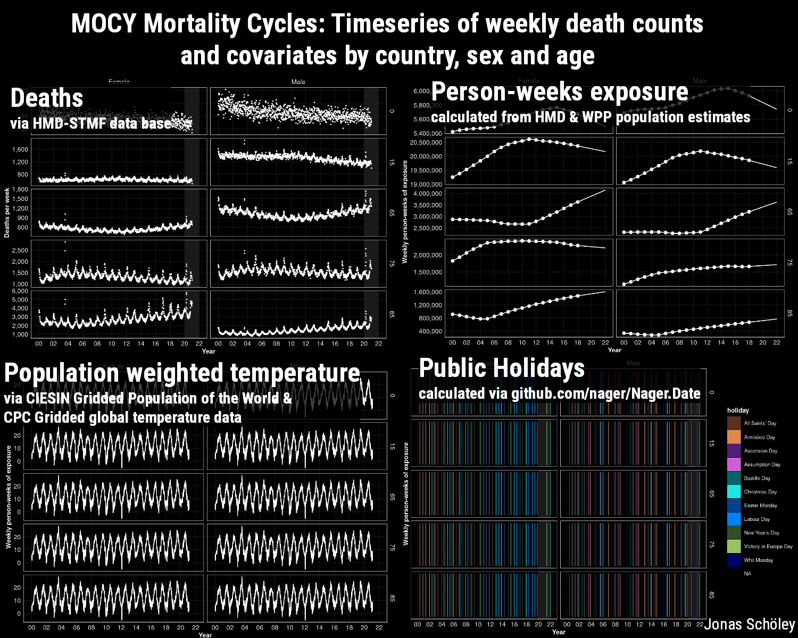

# MOCY Mortality Cycles: Timeseries of weekly death counts and covariates by country, sex, and age

Jonas Schöley. Last updated: 2022-03-15. Version: 2022W10.

MOCY provides time series of weekly death counts stratified by country, sex, and age along with useful covariates such as person-weeks exposure time, population-weighted weekly temperature, and public holiday indicators.

This repository contains the source files needed to compile the MOCY database. The compiled data is hosted at [osf.io/k84rz](https://osf.io/k84rz/).

## Sources

Weekly death counts by country, year, sex, and age:

- sourced from HMD-STMF [1]

Weekly person-weeks of exposure by country, year, sex, and age:

- calculated from interpolated annual January 1st population estimates sourced from HMD [2]

Weekly public holidays by country and year:

- derived using <https://github.com/nager/Nager.Date>

Weekly population-weighted average temperature by country and year calculated from:

- Global gridded population 2010 [3]
- Daily global gridded temperature [4]
- Global national grid embedded in [3]

[1]: HMD-STMF https://www.mortality.org/Public/STMF/Outputs/stmf.csv

[2]: HMD https://www.mortality.org/hmd/zip/by_statistic/population.zip

[3]: Center for International Earth Science Information Network - CIESIN - Columbia University. 2018. Gridded Population of the World, Version 4 (GPWv4): Population Count, Revision 11. Palisades, NY: NASA Socioeconomic Data and Applications Center (SEDAC). https://doi.org/10.7927/H4JW8BX5. Accessed 2021-01-11.

[4]: CPC Global Temperature data provided by the NOAA/OAR/ESRL PSL, Boulder, Colorado, USA, from their Web site at https://psl.noaa.gov/. <https://psl.noaa.gov/data/gridded/data.cpc.globaltemp.html>

## Variable description

### id variables

- id:
  uniquely identifies rows;
  pattern: <region_iso, sex, age_start, year, week>

### strata

- region_iso:
  ISO 3166-1 alpha-2 country code when region is nation-state;
  ISO 3166-2 region code when region is subdivision of nation-state
- sex:
  Male and Female
- age_start:
  integer start of age group [0, 15, 65, 75, 85]
- age_width:
  width of age group; Inf for open age group
- year:
  year as defined in ISO 8601 week date system
- week:
  week as defined in ISO 8601 week date system [0, 52];
  leap-weeks 53 dropped

### additional region information

- region_name:
  natural name of region
- region_level:
  0 for nation state / country level, 1 for subdivision
- country_iso:
  ISO 3166-1 alpha-2 country code
- country_name:
  natural name of country
- hemisphere:
  (n)orth or (s)outh
- continent:
  continent of region

### observations

- deaths:
  number of deaths from any cause
- personweeks:
  person-weeks of exposure
- population:
  population count (only observed in week containing January 1st)
- holiday:
  'none' if week does not feature a public holiday, otherwise name
  of holiday
- temp_c_popwgt:
  population-weighted average temperature in given week and region
  in degrees Celsius
